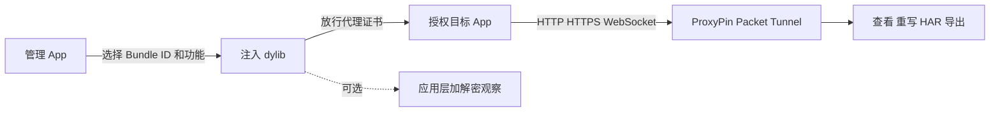

# 独立 iOS 抓包插件方案分析报告

> 当前是架构评估结果，尚未生成可安装插件，也未在实体 iPhone 上进行抓包验证。所有后续测试只面向自有设备和已授权 App。

## 摘要

Android 参考方案的核心不是算法助手 APK 本身，而是三层分工：ProxyPin 负责代理和请求展示，Hook 负责绕过 TLS Pinning，管理工具负责选择目标 App 和查看日志。这套逻辑可以迁移到越狱 iOS，但 Android Java Hook 必须重写为 iOS 原生 dylib。

第一版建议继续使用 ProxyPin iOS 作为抓包层，新开发 `iOSCaptureHook.dylib` 与 `iOSCaptureManager.app`。iOS 15/16 rootless 是主开发范围；iOS 13/14 使用单独 rootful 包，并先连接电脑端 ProxyPin。

## 范围

- Android 参考样本：`算法助手Pro.apk`、`Android(1).js`。
- iOS 抓包层参考：ProxyPin 公共源码 commit `0de13228ac1f325558067625060c4b2c3379fc0e` 与 v1.3.3 release。
- 不分析或修改 AppleLive。
- 不抓取真实用户流量，不注入未经授权的第三方目标 App。
- 报告采用普通移动逆向结构，`flavor = null`。

## 参考方案拆解

| 参考组件 | 已确认职责 | iOS 产品中的替代 |
|---|---|---|
| ProxyPin | VPN/代理、请求展示、重写、HAR | ProxyPin iOS 或电脑端 ProxyPin |
| 算法助手 Pro | Xposed/Frida 容器、作用域、日志 | 自有管理 App、ElleKit/Substrate 注入和本地诊断 |
| `Android(1).js` | TrustManager、OkHttp、WebView、Conscrypt、部分 native TLS 绕过 | Security.framework、NSURLSession、TrustKit、AFNetworking、native TLS Hook |
| LSPosed | 选择被 Hook 的 App | MobileSubstrate/ElleKit Filter 与 Bundle ID 白名单 |
| Magisk CA | 让系统信任代理 CA | 安装 CA 描述文件并开启完全信任 |

`Android(1).js` 中未发现 RTMP/RTSP 解析或 ProxyPin 专用控制接口。它不能单独抓包，也不能自动还原目标 App 的自定义请求体加密。

## iOS 产品结构

### 抓包层

ProxyPin 官方 iOS 源码包含 `NEPacketTunnelProvider`，会配置 HTTP/HTTPS 代理、匹配域和 IPv4 路由。v1.3.3 release 也提供 iOS IPA，因此第一版无需重做请求列表、重写和 HAR 导出。

### 注入层

`iOSCaptureHook.dylib` 按层启用：

1. `SecTrustEvaluateWithError` 与旧版 `SecTrustEvaluate`。
2. `NSURLSession` authentication challenge。
3. TrustKit、AFNetworking `AFSecurityPolicy`。
4. Alamofire 的 Swift ServerTrust 路径。
5. libcurl/OpenSSL/BoringSSL 等目标 App 自带 native TLS。

前 1 至 3 层可作为通用基线。Swift 和静态链接的 native TLS 经常随 App 版本变化，必须单独验证，不能承诺一个固定偏移覆盖所有 App。

### 应用层加密

对于 TLS 解密后仍是一段密文的请求体，增加可选 Hook：

- CommonCrypto：`CCCrypt`、`CCCryptorUpdate`、HMAC、摘要。
- Security.framework：`SecKeyCreateEncryptedData`、`SecKeyCreateDecryptedData`。
- CryptoKit 和自研算法：按授权目标 App 的调用点适配。

这部分默认关闭，且日志只允许写入受控目录、限制容量并进行脱敏。

### 管理层

管理界面只保留普通用户需要的内容：目标 App、抓包、TLS 兼容、HTTP/3 回退、状态自检和最近错误。选择 App 后自动更新注入范围并结束目标进程，用户重新打开目标 App 即可。

## Evidence

| ID | 观察 | 来源 |
|---|---|---|
| E-001 | APK 与 JS 已记录 SHA-256，并保留案件副本 | 本地用户样本 |
| E-002 | Android JS 是 TLS unpinning 层，不是抓包引擎 | `Android(1).js` 静态字符串与 Hook 目标 |
| E-003 | ProxyPin iOS 使用 Packet Tunnel 和 HTTP/HTTPS 代理设置 | 固定 commit 的 iOS 源码 |
| E-004 | v1.3.3 提供 iOS IPA，当前主要 target 为 iOS 15.0 | release 元数据与 Xcode 工程 |
| E-005 | Android Java Hook 必须映射为 iOS 原生信任和网络库 Hook | 跨平台调用点映射 |

完整记录位于 `../research/case/ios-capture-design/evidence/`。

## Findings

### F-001
- severity: n/a_re
- status: validated
- confidence: high
- location: `Android(1).js` TLS Hook 集合
- evidence_ids: [E-001, E-002]
- conclusion: Android JS 只负责证书与 Pinning 绕过，iOS 产品仍需独立的代理/VPN 抓包层。

### F-002
- severity: n/a_re
- status: validated
- confidence: high
- location: ProxyPin iOS Packet Tunnel 与 VPN entitlements
- evidence_ids: [E-003, E-004]
- conclusion: ProxyPin 可以作为第一版 iOS 抓包层，新开发重点应放在注入兼容和管理体验。

### F-003
- severity: n/a_re
- status: candidate
- confidence: medium
- location: rootful/rootless 文件路径、依赖与 ProxyPin 版本边界
- evidence_ids: [E-004, E-005]
- conclusion: 不应把一个 dylib 或 deb 宣称为所有 iOS 版本通用；安装器可隐藏差异，但底层仍需分别构建。

### F-004
- severity: n/a_re
- status: validated
- confidence: high
- location: TLS 明文与应用层二次加密之间的边界
- evidence_ids: [E-002, E-005]
- conclusion: 未知请求体算法需要按目标 App 增加适配器，无法依靠通用 TLS Hook 自动解密。

## Path

### P-001
- path_type: callflow
- start: 授权目标 App 发出 HTTPS 请求
- goal: ProxyPin 展示并导出明文请求和响应
- steps:
  1. 管理 App 将目标 Bundle ID 写入注入白名单。`E-005`
  2. dylib 在匹配的信任层接受用户已信任的 ProxyPin CA。`E-002`、`E-005`
  3. ProxyPin Packet Tunnel 将 HTTP/HTTPS 流量导向代理。`E-003`
  4. ProxyPin 展示、过滤、重写或导出 HAR。`E-003`、`E-004`
  5. 遇到二次加密时，可选适配器观察加解密调用。`E-005`
- residual_risks: QUIC 无 TCP 回退、静态链接 native TLS、越狱检测、自定义加密和未验证系统版本。

## 兼容性结论

| 系统 | 产品路径 | ProxyPin |
|---|---|---|
| iOS 13.x rootful | 单独 `iphoneos-arm` 包，Substitute/Substrate | 先使用电脑端 |
| iOS 14.x | 按越狱形态分包 | 优先电脑端 |
| iOS 15/16 rootless | `iphoneos-arm64` 包，ElleKit | 手机端或电脑端 |
| iOS 17+ | 取决于可用越狱和注入框架 | 暂不承诺 |
| 仅 TrollStore、未越狱 | 每 App 注入的独立分支 | 不能替代越狱主方案 |

## 下一验证门槛

先在一台 iOS 15 rootless 设备和一个自有测试 App 上完成：普通 HTTPS、Pinned HTTPS、WebSocket、HTTP/3 回退、HAR 导出。通过后再构建 iOS 13 rootful 版本。实体机结果必须与构建通过分别记录。
