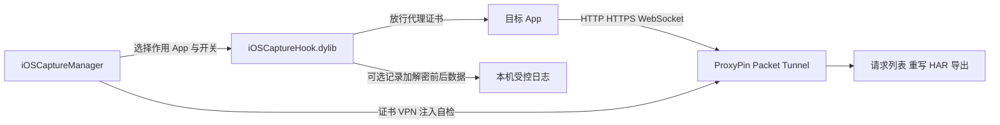

# iOS 抓包插件架构与可行性

## 结论

方案可行，且 Android 参考方案的职责可以一一映射到 iOS。不能直接使用 Android JS 或 APK；需要保留其分层逻辑，并把注入层重写为 iOS 原生 dylib。

## Android 方案到 iOS 的映射

| Android 参考组件 | 实际职责 | iOS 对应实现 |
|---|---|---|
| Root + Magisk | 取得系统级能力 | Dopamine/ElleKit、unc0ver/Substitute 或其他受支持越狱环境 |
| LSPosed 作用域 | 决定注入哪些 App | MobileSubstrate/ElleKit Filter + 管理 App 生成目标 Bundle ID 列表 |
| 算法助手 Pro | Hook 容器、脚本与日志 | 自有 Manager App + 原生注入 dylib + 受控日志服务 |
| `Android(1).js` | 绕过 Java/native TLS 校验 | Security.framework、NSURLSession、TrustKit、AFNetworking、BoringSSL/libcurl Hook |
| ProxyPin VPN | 代理、解密、展示、重写、导出 | ProxyPin iOS 的 Network Extension/Packet Tunnel |
| Magisk 系统 CA | 信任 MITM 根证书 | 安装 ProxyPin CA 描述文件，并在“证书信任设置”开启完全信任 |

## 组件设计

### 1. ProxyPin 抓包层

ProxyPin 官方仓库声明支持 iOS，iOS 端包含 `NEPacketTunnelProvider`、HTTP/HTTPS 代理设置、全局 IPv4 路由和 VPN 管理代码。它适合继续负责：

- HTTP、HTTPS、WebSocket/WSS 请求展示。
- 域名过滤、请求重写、映射、阻断。
- HAR 导入导出。
- 已知 AES 参数下的请求体解密。

这层看不到明文的常见原因是目标 App 不信任代理证书、做了 Pinning、走 QUIC/HTTP3，或请求体在应用层再次加密。

### 2. `iOSCaptureHook.dylib`

第一层实现通用 TLS Hook：

- `SecTrustEvaluateWithError`。
- 旧系统使用的 `SecTrustEvaluate`。
- `NSURLSession` authentication challenge。
- TrustKit、AFNetworking `AFSecurityPolicy`。
- Alamofire 的 ServerTrust 路径需要按 Swift 版本和目标 App 单独适配。

第二层实现 native TLS 适配：

- libcurl/OpenSSL 风格验证回调。
- App 内置 BoringSSL 的 custom verify 回调。
- 对没有稳定导出符号的静态链接库，必须按目标 App 版本做特征匹配，不能承诺一个偏移覆盖所有 App。

第三层是可选的应用层加密观察：

- CommonCrypto：`CCCrypt`、`CCCryptorUpdate`、HMAC、摘要。
- Security.framework：`SecKeyCreateEncryptedData`、`SecKeyCreateDecryptedData`。
- CryptoKit 或自研算法通常需要针对目标 App 的 Swift/ObjC 调用点适配。

日志默认只在用户选择的目标 App 中启用，并限制大小、自动脱敏；不应全局注入 SpringBoard、系统服务和所有 App。

### 3. `iOSCaptureManager.app`

界面保持简单，只保留：

- 目标 App。
- 抓包开关。
- TLS 兼容开关。
- HTTP/3 回退开关。
- ProxyPin、VPN、CA、注入状态。
- 最近错误和导出诊断。

用户选择目标 App 后，管理端更新注入过滤配置并结束目标 App；用户再次打开目标 App即可生效。高级 Hook 细节放入诊断页。

### 4. HTTP/3 与 QUIC

Proxy MITM 主要处理 TCP 上的 HTTP/1.1 和 HTTP/2。对 UDP/443 的 QUIC 流量，第一版采用可选的“HTTP/3 回退”：阻止目标 App 使用 UDP/443，让支持回退的服务改走 HTTP/2。没有 TCP 回退的 App 会联网失败，因此该开关不能默认强制开启。

## 与 Android JS 的关键差异

`Android(1).js` 已覆盖 TrustManager、OkHttp CertificatePinner、WebView、Conscrypt 和部分 BoringSSL 校验，但它不负责抓包、RTMP/RTSP 解析或请求体算法还原。iOS 版也应保持同样边界：TLS Hook 只解决“代理证书不被接受”，抓包由 ProxyPin 完成，自定义请求加密由单独适配器处理。

## 交付建议

- 测试期：ProxyPin iOS + Frida/Objection 验证 Hook 点。
- 产品期：把验证后的 Hook 改写为 Objective-C/C/C++ dylib，取消普通用户对 Frida 和脚本导入的依赖。
- rootful 与 rootless 使用不同安装包；批量安装器自动识别并选择。
- 所有 Hook 仅用于用户自有设备和已授权 App 测试。
