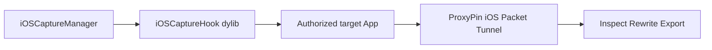

# Standalone iOS Packet-Capture Plugin Analysis

## Scope

This report covers the supplied Android APK and Hook JS as reference samples, public ProxyPin iOS source at commit `0de13228ac1f325558067625060c4b2c3379fc0e`, and the architecture of a new jailbreak iOS product. AppleLive, live traffic and third-party target binaries are excluded.

## Result

The design is feasible. ProxyPin already supplies an iOS Packet Tunnel and request UI. The new product should implement a native iOS injection layer and a simple manager rather than porting the Android APK or executing its Java Hook JS.

## Evidence

| ID | Observation |
|---|---|
| E-001 | Supplied APK and JS identities are fixed by SHA-256. |
| E-002 | Android JS handles TLS trust and pinning hooks; it is not the capture engine. |
| E-003 | ProxyPin iOS uses `NEPacketTunnelProvider` and HTTP/HTTPS proxy settings. |
| E-004 | ProxyPin v1.3.3 ships an iOS IPA; current main target is iOS 15.0. |
| E-005 | iOS requires Security.framework/NSURLSession/native TLS equivalents. |

## Findings

See `findings.md`. The key implementation decisions are:

1. Reuse ProxyPin as a separately installed capture layer for the first release.
2. Build an Objective-C/C/C++ dylib for TLS trust hooks and optional crypto observation.
3. Build a small manager App for target selection, health checks and logs.
4. Package rootful and rootless builds separately, then hide that distinction in the installer.
5. Treat QUIC, native TLS and custom request-body encryption as explicit compatibility modules.

## Compatibility

iOS 15/16 rootless is the main path. iOS 13/14 uses a separate rootful module and initially sends traffic to ProxyPin on a computer because the reviewed current ProxyPin iOS target is iOS 15. TrollStore-only installation remains a later branch and does not provide the same reliable global injection as a jailbreak.

## Path

The end-to-end callflow is recorded in `paths.md` as P-001.

## Remaining validation

No physical iPhone capture has been run for this new project. The next gate is a controlled test App on one iOS 15 rootless device and one iOS 13 rootful device, measuring basic HTTPS, pinned HTTPS, WebSocket, HTTP/3 fallback and HAR export.
